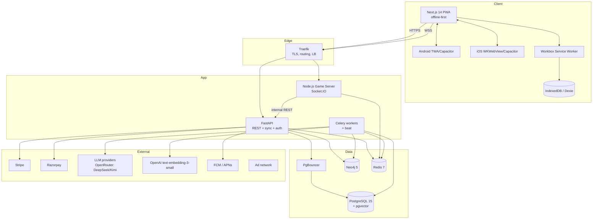

# Vedic Math Speed Gym — Technical Architecture

**Derived from:** RFP v7.2 (2026-07-01, 365 specs) reconciled against Architecture v5.2 docs (INDEX.md, SHARED_REFERENCE.md, decision-engine / gaming / topic-browser / revenue / v5 spec sets).
**Author:** Engineering (architecture pass)
**Date:** 2026-07-04
**Status:** Proposed — for client sign-off before Sprint 0
**Delivery model:** Phase 1 Build (0–5,000 users, 2 droplets) → Phase 2 Activation (>5,000 users, 22 droplets)

---

## 0. How to read this document

This is the buildable architecture for the RFP's **required** two-phase delivery. Where the RFP and the older v5.2 architecture docs disagree, **the RFP wins** (it is the client's contract), and I note the reconciliation. Where the RFP has a genuine technical risk, I implement the RFP intent but add a guard and log it in the [Risk Register](#18-risk-register). Section 1 is the RFP verdict; sections 2–17 are the architecture; sections 18–19 are risks and open decisions.

---

## 1. RFP assessment

### 1.1 Verdict

**The RFP is good — materially better than the sprawling v5.2 docs it was distilled from.** It is comprehensive (365 numbered specs across lifecycle, psychometrics, RAG, gaming, platform, infra, mobile, testing), it carries concrete formulas and parameter bounds, and it silently **resolves several long-standing contradictions** in the architecture corpus:

| Old contradiction (v5.2 docs) | RFP v7.2 resolution |
|---|---|
| `plan_tier` = `free/pro/master` vs `free/pro/bundle_2/bundle_3` | **Settled:** `free/pro/bundle_2/bundle_3` ($0 / $6 / $9.60 / $12.60) everywhere (SUB-01..04). |
| Backend language: CLAUDE.md said Node/Express; docs said FastAPI | **Settled:** FastAPI (Python) is the application backend; Node.js is **only** the Socket.IO game server (CONSOLIDATED-01, §26). |
| BKT priors: `0.35/0.14/0.10/0.20` (arch review) vs `0.5/0.1/0.25/0.1` (backend) | **Settled:** `P(L₀)=0.35, P(T)=0.14, P(S)=0.10, P(G)=0.20, P(F)=0.007/day` (BKT-01..05). |
| Infra cost curve ($168/$330/$900 vs $108/$258/$836) | **Settled:** Phase 2 = **$836** (CONSOLIDATED-02). |
| Single Stripe processor | **Improved:** Stripe **+ Razorpay** (India market) (PAY-01/02). |

It also adds production concerns the v5.2 docs never covered: dual mobile shells (TWA/Capacitor + WKWebView), a full CI/CD + Fastlane pipeline, WCAG 2.1 AA accessibility, an OWASP Top-10 security matrix, k6 load profiles with explicit SLAs, and 8 go/no-go gates. As a contract to build against, it is usable today.

### 1.2 Substantive issues (these shape the architecture below)

I am flagging eight items. None are fatal; all are designed around in this document.

1. **Scope-vs-timeline is over-ambitious.** 15 weeks for Phase 1 to deliver *all of*: auth + dual payments + family plans, the full Decision Engine (**BKT + IRT-3PL + PFA + Glicko-2 + DINA + DFV + Subject Router**), the RAG ingestion pipeline + grounded chatbot + parametric generation, solo **and** multiplayer WebSocket gaming, basic social, CAT/GMAT/GRE mocks, **and** Android + iOS shells at ≥80% coverage. The v5.2 plan budgeted ~20–24 weeks for the backend stream *alone*. **Recommendation:** keep the 15-week calendar but cut Phase-1 model scope (see #2) and treat the Sprint 4 RAG/content work as integration of *already-ingested* content, not a fresh 9,686-chunk ingestion.

2. **DINA, full 3PL IRT, and hIRT in Phase 1 are premature.** DINA needs `N ≥ 20·2^K` calibrated attempts per item (K=5 → 640) plus a human-curated Q-matrix (≥200 approved items) before its slip/guess estimates mean anything; 3PL needs ≥200 responses/item to fit the guessing asymptote. At 0–5,000 users there is no such data. Building the code is fine; **letting these models drive routing on day one produces cold-start garbage.** The v5.2 docs correctly gate them to 10K+ users. **Recommendation:** Phase 1 ships **client-side BKT with fixed priors + a single θ per subject via 2PL-lite**; DINA/3PL/Glicko-2 run in *shadow mode* (compute + log, do not route) until their per-item data thresholds are met, then flip via feature flag. This satisfies the RFP's "code delivered" requirement while protecting learners from noise. (See [§7.7](#77-model-phasing).)

3. **The 2-droplet → 22-droplet cliff at exactly 5,000 users is a risky discontinuity.** Jumping $80–120/mo → $836/mo and 2 → 22 nodes in one 6-week window is a large, all-at-once migration. The v5.2 scaling plan had a smooth curve ($12→$24→$108→$258→$836). **Recommendation:** insert an optional **intermediate stage (~6 droplets, ~$108/mo)** that can be stood up in days if growth is steady but sub-5,000, de-risking the big migration. (See [§14.3](#143-recommended-intermediate-stage).)

4. **10% sampling of "raw attempts" will corrupt BKT (COG-07, QA-SLA-06).** The v5.2 analysis is explicit: sampling `problem_attempt` produces **P95 ≈ 33pp, P99 ≈ 69pp** mastery error. The RFP repeats this as a general rule. **Fix baked into this architecture:** sampling applies **only to non-psychometric events** (`page_view`, `hint_used` UI telemetry, `widget_expanded`, etc.). `problem_attempt`, `problem_solved`, `trap_triggered`, `session_end`, and any event feeding BKT/IRT/DFV are **always ingested at 100%**, regardless of DAU. (See [§11.3](#113-sampling-policy-corrected).)

5. **Dark-pattern bots + COPPA kids mode is a compliance collision.** The RFP keeps non-disclosed bots (GAM-ACH-03, TEL-18 `bot_match_flag`) *and* a COPPA kids tier (FAM-05). Non-disclosed AI opponents in a product used by under-13s is exposed under COPPA, EU DSA Art. 24-adjacent transparency norms, and Apple/Google store policies. **Recommendation:** keep bot backfill (it solves the cold-start empty-lobby problem) but (a) **never** expose bots to kids/COPPA accounts, (b) ship a neutral "may include AI-paced opponents" disclosure in ToS + a subtle in-match affordance, (c) generate **human-plausible bot user IDs** (never `bot_<uuid>`), and (d) weight bot-round ELO at 0.5×. (See [§9.4](#94-bot-engine).)

6. **Content-safety trust ladder is under-specified.** The RFP has SymPy verify + timeout + circuit breaker (GEN-02/03/04) and 2/2 jester consensus (RAG-07), but not the `QUARANTINED → SANDBOX → TRUSTED → LIVE` lifecycle, health scoring, or the rule that SANDBOX content never feeds mastery or mocks. That machinery is what keeps a hallucinated problem from poisoning BKT. **I re-introduce it** as the content governance layer (see [§8.3](#83-content-trust-ladder--5-gate-pipeline)); it is cheap and non-optional for a "zero-hallucination" promise.

7. **Content-readiness blockers are invisible in the RFP.** The RFP assumes content exists. The v5.2 state is: 1,707 computable templates deployed, but **240 `:Problem` nodes have empty `question_text` (launch blocker), `PREREQUISITE_OF` edges are sparse, and the v1 verifier has a 63.7% false-positive rate.** Sprint 0/1 must include a content-readiness gate or the practice engine ships on broken data. (See [§8.5](#85-content-readiness-gate-phase-1-blocker).)

8. **Leftover 5-phase taxonomy pollutes the 2-phase model.** The telemetry table (TEL-09..33) still tags events "Phase 3: Gaming / Phase 4: Social / Phase 5: Enterprise," contradicting the RFP's own two-phase framing. Cosmetic, but the event registry should be re-tagged `phase_1_build` / `phase_2_activation` + a `feature_flag` column to avoid confusing implementers. (See [§11.1](#111-event-registry).)

### 1.3 Minor / cleanup items

- **IRT-10** ("6 chart types θbar/θline/θpie…") conflates ability estimation with dashboard visualization — treat as UI, not psychometrics.
- **Kokoro TTS** (SAFE-GATE-03) appears once, unspecified — either fully scope narrator audio or defer it.
- **hIRT / Thompson-Sampling MAB / Churn-GBT** (Phase 2) are named but never specified — acceptable for an RFP, but Phase 2 needs its own spec before Week 16.
- CAT mock penalty is correctly **−1/3** for MCQ (MOCK-EXM-01), fixing the `−1` vs `−0.33` drift in the old docs.

---

## 2. Architecture principles

1. **Offline-first is the product, not a feature.** The game loop must run with zero network. All psychometric updates happen client-side; the server is the system of record but is never in the hot path of answering a problem.
2. **Dual database, never collapsed.** Postgres is the immutable **Ledger** (events, aggregates, billing, BKT snapshots, pgvector). Neo4j is the **GPS** (techniques, prerequisites, traps, mastery edges). They serve different query shapes; merging them is explicitly out of bounds.
3. **No live LLM in the runtime loop.** LLMs run only in (a) the nightly/async content factory and (b) the opt-in, online-only study chatbot. The game loop serves pre-verified static content or locally-generated-and-SymPy-verified content.
4. **Psychometric integrity over telemetry economy.** Events that drive mastery are never sampled, never dropped by eviction, never merged blindly across devices (server recomputes from raw).
5. **Everything Phase-2 ships in Phase 1 behind a flag.** Boss/Relay/Tournament/Hubs/Location and the heavy ML models are code-complete and dark-launched; activation is a config flip gated on data + infra readiness, not a redeploy.
6. **Safety gates are declarative and server-authoritative.** Answer validation, anti-cheat, subscription entitlement, and content trust are enforced on the server; the client HMAC/offline checks are UX conveniences, not security boundaries.

---

## 3. System context & topology

### 3.1 Logical context



### 3.2 Phase 1 physical topology (2 droplets, $80–120/mo, 0–5,000 users)

Two shared-CPU droplets (4 GB RAM each) inside a **VPC private network** (INF-SEQ-01). Bind DB/Redis to VPC-local IPs only.

```
Droplet A (edge + app)                    Droplet B (data)
├── Traefik (80/443)                      ├── PostgreSQL 15 + pgvector
├── FastAPI (uvicorn, N workers)          ├── Neo4j 5 (community)
├── Node.js game server (3001, internal)  ├── Redis 7 (+ Sentinel single)
├── Celery worker + beat                  └── PgBouncer (transaction pooling)
└── PgBouncer client-side (optional)
```

**RAM budget on Droplet B is the binding constraint** (Postgres + Neo4j + Redis co-located on 4 GB). Mitigations: Neo4j heap capped (≤1 GB, page-cache ≤1 GB), Postgres `shared_buffers` ≤1 GB, Redis `maxmemory` ≤512 MB with `allkeys-lru`, aggressive `pg_partman` + nightly cold-tier offload so the events partition never bloats. This is why the Phase-1 psychometric compute is pushed to the client — the server co-tenancy cannot absorb per-attempt IRT.

### 3.3 Phase 2 physical topology (22 droplets, $836/mo, >5,000 users)

Activated by GATE-08 (5,000 DAU sustained 7 days). Blue-green, dual-write, zero-downtime (INF-SEQ-09, B.2).

```
CDN (CloudFlare Pro) → Load Balancer
  ├── 8× FastAPI droplets
  ├── 2× Node.js game-server droplets (Redis adapter for cross-pod rooms)
  ├── Postgres cluster: 1 primary + 4 cascading read replicas (streaming repl)
  ├── Neo4j: 1 primary + 1 read replica (Enterprise)
  ├── Redis Cluster: 6 nodes (3 primary + 3 replica)
  ├── 2× Celery worker droplets (+ ML nodes)
  └── Monitoring: Prometheus + Grafana + PagerDuty
```

New in Phase 2: feature-flag activation of Boss/Relay/Tournament/Hubs/Location, plus **hIRT, Thompson-Sampling MAB (content/difficulty bandit), Weekly Churn GBT** on the ML nodes.

---

## 4. Component architecture

### 4.1 Frontend PWA (Next.js 14)
- **Stack:** Next.js 14 App Router (static export), Zustand (client state), TanStack Query (server cache), Dexie.js (IndexedDB), Workbox (service worker), ShadCN/React UI.
- **Offline core:** the entire practice loop (session composition read-model, BKT update, DFV, problem rendering, answer validation for the ~68% of templates with client-extractable answers) runs offline. Only the ~25% of templates needing server SymPy and the study chatbot require connectivity.
- **State stores (Zustand):** `masteryState`, `sessionConfig`, `fatigueMonitor` (CLR trigger `fatigueIndex>0.7 && errorRateRecent>0.4`), `behavioralProfile`, plus gaming stores (`gameStore`, `lobbyStore`, `socialStore`).
- **Renderer layer:** `visual_scaffold.type` → renderer router (ArrowMatrix, StrikePad, NumberLine, GridDerivation, EquationChain, ShapeCanvas) with `TextScaffold` as the base/fallback (also the SolveAlongStepper). Pure client SVG, step-reveal.
- **ExplainerCard v2:** Formula-first — L0 formula card always visible, L1 progressive disclosure, L2 difficulty tabs (GEN-06).

### 4.2 Mobile shells
- **Android:** Trusted Web Activity (preferred) or Capacitor wrapper. Target SDK 34 / min SDK 24. `navigator.storage.persist()` forced at onboarding (AND-03). FCM push (AND-04). ProGuard/R8 (AND-05). Cold start <2 s, ≥60 fps, <2%/hr battery (AND-08).
- **iOS:** WKWebView or Capacitor. Target iOS 16+ / min 14. APNs push. `navigator.storage.persist()` first-launch (iOS Safari evicts IndexedDB otherwise) — this is also SAFE-GATE-05. Cold start <2 s, <3%/hr battery.
- **CI/CD:** single Fastlane `Fastfile` (android + ios lanes), triggered on `v*.*.*` tag; GitHub Actions (JDK 17 / macOS-14 + Xcode 15); Fastlane Match for certs; staged rollout (Android 10→25→50→100%; iOS 1%/day over 7 days; halt if crash-free <99.5%).

### 4.3 FastAPI backend (application core)
Services (modular routers, single deployable in Phase 1, horizontally scaled in Phase 2):
- **Auth** (register/login/refresh, JWT 15-min access + refresh rotation, OAuth, scanner-login pairing).
- **Subscription/Billing** (Stripe + Razorpay webhooks, entitlement, family seats, offline-token minting).
- **Session Manager** (`composeSession()` server variant + offline prescription minting).
- **Problem/Question Bank** (Neo4j route → JSONL template fetch → property map; SymPy validation endpoint).
- **Psychometrics** (BKT snapshot ingestion, θ refit, model parameter push to clients).
- **Telemetry Ingest** (3-path write; batch INSERT; idempotent `ON CONFLICT`).
- **RAG Service** (chatbot query, reference retrieval via pgvector).
- **Admin** (materialized-view dashboards, content ops, user management).
- **Internal API** (loopback + `X-Internal-Key`) consumed by the game server for user context, match-complete rating writes, bot θ, problem batches.

### 4.4 Node.js game server
Separate microservice (port 3001, internal), Socket.IO v4, **shared `JWT_SECRET`** with FastAPI. Namespaces `/lobby`, `/game`, `/spectate`. In Phase 2 it runs 2 pods behind the LB with the `@socket.io/redis-adapter` for cross-pod rooms. Authoritative for match state, timing, scoring; calls FastAPI internal API to persist results and pull IRT/ELO context. Details in [§9](#9-gaming--social).

### 4.5 Celery workers (+ beat)
Async/scheduled work off the request path: RAG ingestion & nightly content validation, parametric pre-warming (100 problems/pattern at 00:00 UTC), pool replenishment (spawn 100 questions if unused pool < 50 — ROU-01), BKT offline re-fitting, matchmaking tick (Phase 2), tournament orchestration, daily-challenge generation, leaderboard snapshots, cohort/cap recompute, churn scoring (Phase 2). Scheduled via `pg_cron` (DB-side KPI refresh) + Celery beat (app-side jobs).

### 4.6 Traefik + PgBouncer
Traefik terminates TLS, routes `/api/*`→FastAPI and `/game`(wss)→game server, provides the LB seam that Phase 2 expands. PgBouncer transaction pooling (max_client_conn 10000, pool 25) protects Postgres; SAFE-GATE-07 drops non-critical **read** queries when pool >90%.

---

## 5. Data architecture

### 5.1 PostgreSQL — "the Ledger"

Grouped by domain (canonical column notes in brackets). All PKs UUID.

**Identity & billing**
- `users` [tier `free|pro|bundle_2|bundle_3`, active_path, target_exam, exam_date, days_to_exam (trigger-computed), coverage_pct, behavioral_profile JSONB]
- `family_accounts` / seat licenses [parent anchor, ≤3 children, seat active/suspended toggle]
- `subscriptions` [Stripe + Razorpay customer IDs, MRR cents, status, period start/end, trial]; view `mrr_live`
- `user_growth` [cohort_week, acquisition_channel, funnel timestamps, engagement_score, churn_risk]
- `referrals` [per-gate booleans, status `pending|verified|rejected|rewarded`, milestone level]

**Learning & psychometrics**
- `user_technique_states` [mastery_score, state (trigger-computed), seen_learn/seen_hybrid, exposure_state]
- `sessions` [prescription JSONB, session_type `learning|topic_browser|mock_exam|remediation`, execution_mode `PRACTICE|MOCK_EXAM`]
- `problem_attempts` [state-recompute trigger; cognitive_latency_ms, hint_level, verifier_version]
- `bkt_state_snapshots` [JSONB technique_states, 20:1 rollup, 365-day retention]
- `fatigue_snapshots`, `behavioral_profiles` [K-Means cluster + features JSONB]
- `user_cognitive_profiles` [θ per subject, subject_profiles JSONB (Glicko/DINA state)]
- `sinking_skills` [decay_priority, consecutive/total errors, triggered_by, source_problem_ids[], trap_types[]]
- `mock_exam_attempts` [total/max score, percentile, section_scores JSONB, weak_areas JSONB, deferred_sinking_skills JSONB]
- `exam_deadlines` [priority 1–5, UNIQUE(user, exam) — multi-exam], `damage_control_events`, `user_topic_weights`

**Content & RAG**
- `knowledge_chunks` [pgvector embedding(1536), pillar, topic, sub_topic, IVFFlat index lists=100]
- `generated_problems` [SHA-256 params_hash dedup], `generation_patterns`
- `content_validation_log`, `problem_health_scores` [trust_level, component scores], `llm_generation_audit`, `problem_user_matrix`
- `audit_log` [LLM traceability — INSERT after every LLM call]

**Telemetry & ops**
- `raw_events` [monthly `pg_partman` partitions, 90-day retention]
- `trap_triggered` (denormalized), `session_sequence`
- `game_matches`, `player_match_results`, `player_elo_ratings`, `ghost_sessions`, `daily_challenge_*`, `taunt_log`, `shareable_clips`, `bot_activity_log` (+ Phase 2: `tournaments*`, `relay_race_sessions`, `boss_battle_sessions`, `hubs`/`hub_members`, `location_checkins`, `user_churn_scores`)
- `ad_impressions`, `offline_ad_debt`, `user_ad_cohorts`
- `kpi_metrics`; materialized views: `kpi_dashboard_core`, `user_technique_summary`, `vw_impression_kpi`, `vw_cohort_revenue`, `vw_offline_debt_summary` (refresh CONCURRENTLY every 15 min via `pg_cron`, ADM-06)

> **Reconciliation note:** `problem_health_scores` is defined twice in the legacy corpus with conflicting DDL (5-value vs 4-value trust enum). This architecture uses the **5-value** enum from RUNTIME_SAFETY (`LIVE / TRUSTED / SANDBOX / QUARANTINED_SOFT / QUARANTINED_HARD`, default `QUARANTINED`) as canonical; the cat_content variant is dropped. Fix the broken `idx_ubc_confidence` index (references non-existent `primary_confidence`; should be `secondary_confidence`) during Sprint 0 schema consolidation.

### 5.2 Neo4j — "the GPS"

**Nodes:** `Technique` (473; is_high_yield, exam_weight), `Sutra` (16), `Problem`/`SolveAlong` (1,707), `Computable` (1,707), `ProblemTemplate` (~50), `Concept`, `Skill`, `LogicTrap` (name index **non-unique** — 24 names across ~908 nodes; do not re-add uniqueness), `MockExam` (15), `ExamBlueprint` (3: CAT/GMAT/GRE), `Section` (9), `UnlockSchedule`, `User`, `Hub` (Phase 2), `Bot` (never linked to a User visibly).

**Relationships:** `REQUIRES`/`PREREQUISITE_OF` (prereq chain, ≤3–5 hops), `TRAPS_PRESENT`/`CONTAINS_TRAP` (2,782 edges, 88.5% coverage), `OPTIMIZES_SPEED_OF` (Vedic→exam crossover), `HAS_SECTION`, `CONTAINS_QUESTION`, `FOLLOWS_SCHEDULE`, `COMPLETED`, `HAS_SKILL_LEVEL`, `SINKING_SKILL` (decay_priority), `SOLVE_ALONG_START`/`NEXT_STEP`, plus family/social: `PARENT_OF`, `TEACHES`, `FRIEND_WITH`, `MEMBER_OF` (Phase 2).

> **Reconciliation note:** the corpus uses four overlapping names for prerequisite/technique edges (`REQUIRES`, `PREREQUISITE_OF`, `REQUIRES_TECHNIQUE`, `PREREQUISITE_FOR`). **Canonicalize on `PREREQUISITE_OF` (technique→technique) and `REQUIRES` (problem→technique)** to match the RFP's §26 mapping (`[:PREREQUISITE_OF]`, `[:CONTAINS_TRAP]`, `[:OPTIMIZES_SPEED_OF]`). ROU-02 mastery gate is **P(L) ≥ 0.85** on the parent node.

### 5.3 Redis — cache + coordination
24-h TTL generative-content cache; session/topic/problem read caches (5 min / 1 h / 30 min); matchmaking lobby sorted-sets and match-state hashes (game server); presence (60 s); rate-limit counters; QR nonce (300 s, one-time); dedup set `user:{uid}:seen` (7-day cross-category). `maxmemory-policy allkeys-lru`, `maxmemory` capped in Phase 1.

### 5.4 Client edge — IndexedDB (Dexie)
Tables: `profiles`, `events`, `offlineQueue`, `problems`, `sessions`, `bktSnapshots`, `behavioralProfiles`, `offlineProblemPool` (500-item LRU, 7-day expiry), `cachedAdUnits`, `impressionQueue`. Eviction is **priority-scored** (session_end/subscription=10 never drop, problem_attempt=5, page_view=0 drop first); buffer 500 (iOS 50). `buffer_overflow` emits an audit event.

### 5.5 Three-path write
Every ingested event fans out:
```
Event → PATH A  Postgres raw_events (immutable, batched)
      → PATH B  Postgres aggregates (upsert: user_progress, sessions, sinking_skills)
      → PATH C  Neo4j MERGE (:COMPLETED, :HAS_SKILL_LEVEL, :SINKING_SKILL)
      → PATH D  bkt_state_snapshots (session_end rollup)
```
Postgres↔Neo4j atomicity uses a `sync_outbox` pattern (write intent in PG txn, worker drains to Neo4j) so a Neo4j failure never loses a ledger write.

---

## 6. Offline-first & sync

| Network state | Trigger | Behavior |
|---|---|---|
| Strong online | `session_end` | Flush all queued events |
| Intermittent | every 5 `problem_attempt` | Sync with exp. backoff 1→2→4→8→max 30 s |
| Offline | none | Queue in Dexie indefinitely |
| Reconnect | `navigator.onLine` | Immediate flush, linear backoff 1→2→3 s (max 3) |
| Buffer full (500 / iOS 50) | queue ≥ cap | Evict 20 lowest-priority, emit `buffer_overflow` |

**Multi-device:** never merge `P(L)` directly. On conflict the **server recomputes BKT from unified `raw_events`** and pushes the authoritative snapshot; client shows a reconcile toast if Δ>0.05. Sync SLA: POST `/api/sync` p95 < 500 ms (QA-SLA-05); bulk 500-event replay < 30 s on WiFi (PERF-09). Idempotency via `event_id` + `ON CONFLICT DO NOTHING`.

**Offline entitlement:** server signs `HMAC-SHA256(user_id:expires_at)` on every sync; client verifies locally with a 3-day grace (SUB-10, PAY-05). Tamper/expired → downgrade to free + re-enable ads. The HMAC is UX; the server re-validates entitlement on next online action (secret never leaves server).

---

## 7. Decision Engine

### 7.1 BKT (client-side, Phase 1 primary)
Fixed priors (BKT-01..05): `P(L₀)=0.35, P(T)=0.14, P(S)=0.10, P(G)=0.20, P(F)=0.007/day`; identifiability `P(S)+P(G)<1` (BKT-06).
- Correct: `P(Lₜ|1) = P(Lₜ)(1−P(S)) / [P(Lₜ)(1−P(S)) + (1−P(Lₜ))P(G)]`
- Wrong: `P(Lₜ|0) = P(Lₜ)P(S) / [P(Lₜ)P(S) + (1−P(Lₜ))(1−P(G))]`
- Learn step after each: `P(L)ₙ = P(L') + (1−P(L'))·P(T)`
- Inter-session decay: `P(L)decayed = P(L)·(1−P(F))^(d/45)` (BKT-09)
- **Fluid gate: `P(L) ≥ 0.85`** (BKT-10). Empirical-Bayes shrinkage of the prior after n≥20 attempts (BKT-11).

Cold-start priors from the 6-problem warm-up: correct-first-try 0.80, hint/slow 0.50, wrong 0.20.

### 7.2 IRT (calibration; shadow → live)
3PL for Quant (a,b,c), 2PL for DI (c=0). `P(X=1|θ) = c + (1−c)/[1+e^(−a(θ−b))]` (IRT-06). θ∈[−3,3]; a∈[0.5,2.5]; c default 0.25. θ refit by Newton-Raphson MLE, stop at |Δθ|<1e-4 or 50 iters (IRT-07/09); `SE(θ)=1/√I(θ)`.

### 7.3 PFA
`P(S) = σ(θ_u + Σβ·successes + Σγ·failures)` — separate speed/accuracy credit; used with IRT in the Quant router.

### 7.4 Glicko-2 (LRDI, "Gino")
R∈[800,2400] default 1200; RD∈[30,350] default 350; σ∈[0.03,0.10] default 0.06; τ=0.5. Inactivity decay `RD' = min(√(RD²+c²t), 350)`, c≈0.95/day. Illinois root-finder for σ'. 8 LR sub-rating facets.

### 7.5 DINA (VARC, shadow in Phase 1)
K=5 skills (vocabulary, structure, tone, theme, syntax). Binary J×K Q-matrix (Σqⱼₖ≥1). `P(Xᵢⱼ=1|α) = (1−sⱼ)^η · gⱼ^(1−η)`, η = AND-gate over required skills; s,g≤0.30, s+g<1. EM (Baum-Welch E/M), stop at Σ|Δparam|<1e-6. **Requires curated Q-matrix + N≥640 before going live.**

### 7.6 Cognitive load & DFV
- Base cognitive load `BCL = clamp(1 + 0.4·ops + 0.3·digits + 0.6·carry + 0.2·chars/40 + 0.5·special, 1, 5)` (COG-01); linguistic + working-memory loads similarly (COG-02/03).
- **Fatigue index `= 0.40·F_latency + 0.35·F_accuracy + 0.25·F_entropy`** (COG-06). Age-modulated z-score gates: kids 1.50 / teens 1.80 / pros 2.00 / mature 2.50 (COG-08).
- CLR (general): reduce difficulty, force guided, cap attempts to 3 (COG-09). CLR Stamina (exam sprint): ratio shift 0–45 min 70/30 → 45–90 50/50 → 90–120 30/70 (COG-10).
- **Cognitive-faculty mapping (trive v2):** LogicTrap → CognitiveFaculty enum (WM_OVERFLOW, INHIBITORY_CONTROL, PATTERN_SWITCH…); high INHIBITORY_CONTROL failure force-routes to Guided (COG-MAP-06).

### 7.7 Session composition & Subject Router
`composeSession()` runs **client-side (~50 ms)** for the paid Decision Engine; free tier gets **Topic Browser only** (manual selection, no 60/20/20) (SUB-05).
- Allocation **60/20/20** primary(Fluid)/sinking(Fragile)/frontier(New·Fractured); persona overrides SpeedDemon 70/15/15, BrainTrainer 50/30/20; empty-bucket redistribution.
- Wrong-answer guards: max 3 cycles/technique, 5 wrongs/session, 4 consecutive → forced break, ping-pong 3 toggles/10 → lock HYBRID 24 h.
- **Subject Router** dispatches by subject before composition: Quant→IRT+PFA, LRDI→Glicko-2, VARC→DINA. Age time-multipliers (base 30 s): 8-10 ×2.5 … 18-25 ×1.0 … 61+ ×2.0.

### 7.7 Model phasing

| Model | Phase 1 (0–5k) | Phase 2 (>5k) |
|---|---|---|
| BKT (fixed priors, client) | **Live** — drives routing | Live; monthly EM-refit priors |
| IRT 2PL-lite (single θ/subject) | **Live** — coarse difficulty | Upgraded to 3PL |
| IRT 3PL / PFA | Shadow (compute+log) | **Live** once ≥200 resp/item |
| Glicko-2 (LRDI) | Shadow | **Live** once LRDI volume met |
| DINA (VARC) | Shadow | **Live** once Q-matrix curated + N≥640 |
| DFV / CLR | **Live** | Live; recalibrated weights |
| hIRT, Thompson MAB, Churn GBT | Not built (Phase 2 scope) | **Live** |

"Shadow" = the RFP's "code delivered" is satisfied (models run and log), but they do not route learners until their data threshold flips a feature flag. This is the single most important protection against cold-start harm.

---

## 8. RAG & content pipeline

### 8.1 Ingestion (trive v2, offline factory)
6-station assembly line (Celery, nightly/async), never in the game loop:
`Station 0 Chunker → 1 Digitizer (PDF→markdown) → 2 Context (pgvector lookup, text-embedding-3-small 1536-d) → 3 trive v2 (grounded LLM triplet extraction against ontology registry, NFKC folding, alias mapping) → 4 Math Audit (SymPy) → 5 Dual-DB Ingest (pgvector + Neo4j :Computable)`. **2/2 jester consensus** (RAG-07); regex structural fallback if consensus fails (SAFE-GATE-08).

### 8.2 Parametric generation (runtime, verified)
Jinja2 templates inject randomized parameters (GEN-01); **SymPy** checks equivalence and rejects trivial states (`x·0`, `x−x`, decimal-remainder) (GEN-02, RAG-EXP-07); 5-second validation timeout → static fallback (GEN-03); **circuit breaker trips after 10 SymPy timeouts** → route to static cache (GEN-04). Retry up to 5× then static (RAG-EXP-08). Redis 24-h cache; 100 problems/pattern pre-warmed at 00:00 UTC. Used only for PRACTICE/reinforcement — never mocks or calibration.

### 8.3 Content trust ladder & 5-gate pipeline
*(Re-introduced — under-specified in RFP; required for the zero-hallucination promise.)*

**5 gates (all must pass to enter the pool):**
`Gate 1 SymPy (fail → dead-letter)` → `Gate 2 consensus ≥0.85 (else human review)` → `Gate 3 hallucination ≥0.90 (else quarantine)` → `Gate 4 trap-taxonomy check` → `Gate 5 dedup params_hash (90-day)`.

**Trust ladder:** `QUARANTINED → SANDBOX (≤50 exposures, excluded from mastery/mocks) → TRUSTED (≥30 users, accuracy ±15% of expected) → LIVE (≥100 users, stable 14 d)`. Health score `= sympy·0.40 + trap·0.20 + consensus·0.25 + hallucination·0.15`. Pattern-level freeze: 3+ quarantined children of a `generation_pattern_id` → freeze the whole pattern. **SANDBOX content never feeds BKT or mock exams.**

### 8.4 Study chatbot (RAG-EXP-01/02)
Opt-in, online-only, isolated from the game loop. Ingests BKT state + BCL fatigue + last 3 failed concept nodes; retrieves grounded curriculum via pgvector (cosine >0.70, top-5). **Hard gate: never gives direct answers — hints/scaffolding only.** Token-budget limiter + cost dashboard.

### 8.5 Content-readiness gate (Phase-1 blocker)
Sprint 0/1 must clear, or the practice engine ships on broken data:
1. **Populate 240 empty `:Problem.question_text`** (batch LLM from templates) — **launch blocker**.
2. **Densify `PREREQUISITE_OF`** (currently ~15 edges; run generator) — blocks prerequisite routing & crossover.
3. **Deploy `verify_problem_logic_v2.py`** (v1 has 63.7% false-positive rate that poisons BKT) with timestamp-gated in-place recompute.
4. Apply `updated_schemas.sql` + `updated_schemas_v5.sql` + Cypher to the live DB; wire `audit_log` INSERT after every LLM call.

---

## 9. Gaming & social

### 9.1 Server & transports
Node.js + Socket.IO (Redis adapter in Phase 2). Transports: primary Socket.IO; secondary WebRTC DataChannel (hotspot/LAN, host-authoritative); tertiary QR discovery (HMAC-signed payload, 300-s TTL, one-time nonce — QR-01..06). Topologies: online, pass-and-play, hotspot, qr_nearby.

### 9.2 Modes
**Phase 1 (live):** Solo bot Speed Race & Accuracy Duel; multiplayer duels (matchmaking, ELO, real-time sync); basic social (friends, leaderboards, QR pairing, Ghost recording, shareable clips, comedy taunts, daily challenge).
**Phase 2 (code-complete, flag-off):** Boss Battle (HP=players×3, wrong heals +0.5, 3-wrong enrage +1/3 problems, victory +0.05 P(L) on boss topic — SOC-01..04), Relay Race (baton pass, max 2 retries +10 s, team diff = weighted θ ×1.10 — SOC-05/06), Swiss Tournament (5–7 rounds, Buchholz tiebreak, subject brackets, Top-8 triathlon — SOC-07..09), Virtual Hubs (city/society/school/college/cafe; pre-seed BLR/MUM/DEL 10 bots each; auto-archive <5 users/30 d — SOC-11..14), Location gamification (Strava proximity, cafe QR check-in 2× XP/60 min, GPS geofence ±20 m — LOC-GAM-*).

### 9.3 Matchmaking & rating
Composite score `= 0.4·θ_norm + 0.6·elo_norm`. Pair within ±100 ELO, window +50/5 s (GAM-ACH-01). `Rnew = Rold + K(S−E)`, K=32 duels / 40 tournaments (GAM-ACH-02). ELO₀ = 1000 + 400·θ_u clamped [600,2400]; Glicko-2 RD/σ as §7.4. Fairness rejects θ-delta >0.5 and incompatible clusters (override after 120 s queue); anti-farming/smurf detection on θ/ELO divergence.

### 9.4 Bot engine
Backfill after **15-s** wait (GAM-ACH-03), rating = user ELO ±30, **win-rate capped 45%**. Four IRT-calibrated personas (overthinker/speedster/improver/choker); θ_bot = median(waiting) ± 0.1; realistic timing (base + Gaussian, floor 3 s, + backspaces/hesitations); plausible wrong answers per trap. On human join: finish current problem → 5–8 s "rage-quit" delay → disconnect.

**Compliance guards (mandatory in this architecture):**
- **Never expose bots to kids/COPPA accounts** (FAM-05 tier) — bots disabled for under-13.
- **Human-plausible user IDs only** — never emit `bot_<uuid>`; `is_bot`/`bot_persona`/`bot_count` stripped at the API boundary (validation test: must never appear client-side).
- Neutral "may include AI-paced opponents" disclosure in ToS + subtle in-match affordance.
- Bot-round ELO weighted **0.5×**; post-detection ELO refund path.
- No bots in Daily Challenge (would distort global percentiles) or ranked tournaments (bots capped below Top-8).

### 9.5 Disconnect / anti-cheat
Heartbeat 10 s → 15-s grace (timer paused, events buffered) → forfeit (SAFE-GATE-02). Server-authoritative validation (client never holds answers online). Anti-cheat: reject solve <200 ms or missing keystroke intervals (SAFE-GATE-01), impossible-speed & mastery-jump flags, per-player shuffled queues, spectator 5-s delay.

### 9.6 Comedy / rage-bait
Cluster-gated frequency: Sprinter every 3 (aggressive), Perfectionist every 5, **Deliberate/Rebuilder 0** (SOC-15); **3+ losses disables taunts; ads & taunts off for age <10** (SOC-16). Generated post-match copy compares solve-latency residuals (RAG-EXP-03/04). Clips require dual consent, opponents anonymized (SOC-18).

---

## 10. Payments & subscription
- **Tiers:** Free $0 (ad-supported, 1 lane, Topic Browser only), Pro $6 (1 lane, full DE), Bundle_2 $9.60 (2 lanes), Bundle_3 $12.60 (3 lanes) (SUB-01..06).
- **Track-switch lock:** Free 30-day (bypass via 15 verified referrals); paid 0-day (SUB-07).
- **Processors:** Stripe (`/api/webhooks/stripe`) + Razorpay (`/api/webhooks/razorpay`), signature-verified, sticky-routed to owner node to dodge replication lag (PAY-01..03). Success triggers offline-token rebuild (PAY-04).
- **Family:** parent anchor + ≤3 child seats, volume-discount curve (100/80/60%), active/suspend toggle, webhook syncs seat count (FAM-PRC-*).
- **Referral ladder:** 15 refs → +1 lane, 30 → offline queue, 45 → custom difficulty + analytics, 60 → lifetime ad-free Pro (REF-01..04); referee gets 7-day Pro trial (REF-05). Verification gates: 5+ sessions across 2+ dates ≥25 min, avg >5 min & ≥10 problems, fingerprint/email/IP-/24/behavioral-z uniqueness, ≤3 signups/IP/24 h, 7-day cooldown (REF-06..10).

> **Reconciliation note:** the v5.2 `revenue/INDEX.md` vs `referral_system.md` disagreed on which milestone unlocks the offline queue. **The RFP settles it: 30 refs = offline queue** (REF-02). Use the RFP ladder verbatim.

### 10.1 Ad engine
Never during problem-solving/guided/solve-along/onboarding/remediation/reveal (AD-01); only dashboard/post-session (5-s interstitial)/profile/settings (AD-02). Max 180 s ads/hr, 10-min cooldown (AD-03/04). **Ad-token wallet:** 15 min practice → 30-s ad wall (AD-05). Workbox CacheFirst video pre-cache on WiFi + battery >20% (AD-06); offline impression queue via BackgroundSync (AD-07). Kids: ads 100% disabled (FAM-05).

---

## 11. Telemetry & analytics

### 11.1 Event registry
33 events (TEL-01..33), re-tagged to the two-phase model with a `feature_flag` column (replacing the leftover Phase 3/4/5 labels). Primary storage per event as specified (Postgres `raw_events`/domain tables, Redis for transient match/lobby/leaderboard state). 7-step lifecycle: capture (<5 ms p95) → enrich (<10 ms p95, 4 layers) → Dexie persist → queue-manage → sync (<500 ms p95) → 3-path server ingest → tiered storage.

### 11.2 Tiered storage
HOT IndexedDB → WARM Postgres 90-day partitions → COLD DO Spaces Parquet (2-yr, DuckDB query) → AGGREGATE ∞ (materialized views). Nightly `pg_cron` detaches old partitions → Parquet → object storage (ZSTD).

### 11.3 Sampling policy (corrected)
- **Always 100%, never sampled, never evicted, never blind-merged:** `problem_attempt`, `problem_solved`, `trap_triggered`, `bkt_state_snapshot`, `session_start/end`, `calibration_completed`, `subscription_*`. These feed BKT/IRT/DFV.
- **Sample at 10% only when DAU > 10k:** UI/engagement telemetry (`page_view`, `hint_used`, `topic_selected`, `widget_expanded`, `dashboard_loaded`).

This honors the RFP's *intent* (server-side scale optimization, COG-07/QA-SLA-06) while eliminating the P99≈69pp BKT-corruption failure mode. **Deviation from literal RFP text — see [Risk #4](#18-risk-register).**

### 11.4 Admin views
`kpi_dashboard_core` (DAU/MAU/sessions), `user_technique_summary`, `vw_impression_kpi`, `vw_cohort_revenue`, `vw_offline_debt_summary` (pending sync >4 h). Refresh CONCURRENTLY every 15 min (ADM-06). Fraud-alert gate at failure/signature-mismatch >3% (ADM-08).

---

## 12. API surface (summary)

**REST (22 catalogued):** auth (`/api/auth/register|login|scanner-login/generate|scanner-login/verify`), family (`/api/family/sub-account/create|override`), payments (`/api/webhooks/stripe|razorpay`), mocks (`/api/mocks/configure|submit-answer|results`), chat (`/api/chat/query`), location (`/api/location/checkin`), sync (`/api/sync`), session-key (`/api/session-key`), plus session/problem/telemetry/admin routers. All HTTPS, JWT-bearer, `X-RateLimit-Remaining`.

**WebSocket (9 events):** `join_lobby`, `match_found`, `round_started`, `submit_game_answer`, `round_ended`, `match_ended`, `boss_battle_damage`, `relay_baton_pass`, `team_morale_update`.

> **Reconciliation note:** the v5.2 gaming docs used two divergent Socket.IO vocabularies (`lobby:join`/`game:answer` vs `join_queue`/`submit_answer`). **Adopt the RFP §24 names verbatim** (`join_lobby`, `submit_game_answer`, …) as the contract; GATE-06 tests 22 REST + 9 WS endpoints against them.

---

## 13. Feature flags & phased activation
A central flag service (Postgres-backed, Redis-cached, read at session start) gates: `boss_battle`, `relay_race`, `tournament`, `virtual_hubs`, `location_gamification`, `irt_3pl_live`, `glicko2_live`, `dina_live`, `hirt`, `thompson_mab`, `churn_gbt`. Phase-2 activation (Week 20) is a coordinated flag flip after AB-06 load targets pass and each model's data threshold is met — **not** a redeploy. Emergency kill-switch (`GET /api/config`) can disable any feature or the ad engine within seconds (v3.4 audit D2).

---

## 14. Infrastructure & deployment

### 14.1 Boot sequence (INF-SEQ-01..07)
`VPC private subnet → DB containers (PG, Neo4j, Redis Sentinel) → schema init (Postgres DDL then cypher-shell constraints) → seed_registry_vectors.py grounding → Celery workers → FastAPI → Traefik (TLS, 80/443)`.

### 14.2 Update / deploy (INF-SEQ-08/09)
SQL migrations → Cypher updates → Python backfills; blue-green container swap (spin new → route → drain old); dual-write during schema change, monitor 2 weeks before dropping columns (QA-SLA-07/08); no breaking renames.

### 14.3 Recommended intermediate stage
*(Architecture addition — de-risks the 2→22 cliff, [Risk #3].)*
Insert **Stage 1.5: ~6 droplets, ~$108/mo** (2×API $48, 1×DB $24, 1×Neo4j $12, 1×Redis $12, 1×Celery $12 — mirrors SOC-20). Stand it up if DAU climbs steadily toward 5,000; it splits DB off the app node (removing the Phase-1 RAM crunch) without committing to the full $836 cluster. Phase 2 then migrates from a 6-node baseline, halving the blast radius of the big cutover.

### 14.4 Scaling triggers & load targets
GATE-08: 5,000 DAU sustained 7 days + cost <$836 → Phase 2. Load SLAs: Phase-1 baseline 100 req/s p95<250 ms err<0.1% (AB-03); Phase-2 target 10,000 req/s p95<150 ms err<0.5% (AB-06); 500 concurrent WS duels msg-latency<100 ms p95 (PERF-05). Warning thresholds: PG pool >75%, Neo4j heap >70%, Redis latency >1 ms, ingest >5 ms, next-problem >300 ms.

---

## 15. Security & compliance
- **AuthN/Z:** JWT (15-min access + refresh rotation), scanner-login session binding, RBAC per tier + parent/child + teacher/student isolation (SEC-01/06).
- **Crypto:** HMAC-SHA256 for offline tokens, QR payloads, ad-impression proofs; device fingerprint + nonce replay protection (SEC-02).
- **Injection:** parameterized SQL, Neo4j-driver-parameterized Cypher (SEC-03).
- **COPPA (SEC-08, FAM-05):** kids mode disables ads, minimizes tracking, gates parental consent, suppresses timers, caps sessions (10 min, parent override 20), **and disables bots** (this architecture's addition).
- **Anti-cheat (SAFE-GATE-01):** server-authoritative; reject <200 ms solves / missing keystroke intervals.
- **Declarative validation:** answer verifiers use `{operator, expected, tolerance}` schema, **not** `eval()` (closes the stored-XSS vector in the legacy generator).
- **Gates:** OWASP ZAP clean, 0 high/critical CVEs, container image signing, daily dep audit + annual pentest (GATE-02, ACPT-16).

---

## 16. Testing & quality (Appendix C)
Pyramid: Jest/Vitest (frontend) + pytest (backend) ≥80% statement coverage (QA-SLA-01); integration contract tests for all 22 REST + 9 WS (TST-STRAT-02); Playwright/Cypress for 12 golden journeys (TST-STRAT-03); **psychometric known-answer suites** verifying BKT-07/08, IRT, Glicko-2, DINA against pre-computed estimates (TST-STRAT-04); 8 SAFE-GATE regression scenarios; k6 load runs A–D; axe-core + Lighthouse ≥95 for WCAG 2.1 AA; BrowserStack/Firebase device matrix (DEV-01..08). Go/no-go: GATE-01..08; production rollback criteria ACPT-15 (error >1%/5 min → rollback <2 min; payment-webhook failures >5% → disable subs <5 min; data corruption → restore <30 min).

---

## 17. Delivery plan alignment
Phase 1 = 15 weeks (Sprint 0 foundation → 1 auth/pay → 2 practice/BKT → 3 duel/WS → 4 content/RAG → 5 social/gamification → 6 polish/QA → buffer/store). Phase 2 = 6 weeks (provision → DB migrate → service migrate → load test → feature activation → monitoring/handoff). **Two schedule caveats from [§1.2]:** (a) Sprint 4 must consume *pre-ingested* content, not run a cold 9,686-chunk ingestion; (b) DINA/3PL/Glicko-2 land as shadow code in Phase 1, activated in Phase 2 — otherwise the 15-week calendar is not credible.

---

## 18. Risk register

| # | Risk | Severity | Mitigation (in this architecture) |
|---|---|---|---|
| 1 | 15-week Phase 1 vs full scope (all models + RAG + mobile) | **High** | Model-phasing (§7.7); content pre-ingested; shadow-mode heavy models; explicit Sprint scope caveats (§17). |
| 2 | DINA/3PL/hIRT cold-start with no calibration data | **High** | Shadow mode until data thresholds (N≥640 DINA, ≥200/item 3PL); flag-gated activation. |
| 3 | 2→22 droplet / $120→$836 cliff at 5,000 users | **High** | Optional Stage 1.5 (~6 droplets, ~$108); blue-green + dual-write cutover (§14.3). |
| 4 | 10% sampling corrupts BKT (P99≈69pp) | **High** | Sample non-psychometric events only; BKT-driving events always 100% (§11.3). Needs client sign-off (deviation from literal COG-07). |
| 5 | Non-disclosed bots + COPPA kids mode | **High (legal)** | No bots for under-13; neutral disclosure; human-plausible IDs; 0.5× bot-ELO; no bots in ranked/daily (§9.4). |
| 6 | Content-safety trust ladder under-specified | **Medium** | Re-introduce 5-gate + trust ladder; SANDBOX excluded from mastery/mocks (§8.3). |
| 7 | Content-readiness blockers (240 empty nodes, sparse prereqs, v1 verifier) | **Medium (blocker)** | Sprint 0/1 content-readiness gate (§8.5) as a hard milestone. |
| 8 | Phase-1 RAM crunch (Neo4j+PG+Redis+2 runtimes on 2×4 GB) | **Medium** | Capped heaps/buffers; client-side psychometrics; aggressive partition offload; Stage 1.5 relieves it. |
| 9 | Two co-existing WS event vocabularies & schema double-defs | **Low** | Canonicalize on RFP §24 names + 5-value trust enum (§5.1, §12). |

## 19. Open decisions needed from client

1. **Sampling deviation (Risk #4):** confirm we exclude BKT-driving events from the 10% sample. *(Strong recommendation: yes.)*
2. **Model phasing (Risk #2):** approve shadow-mode for DINA/3PL/Glicko-2 in Phase 1, live in Phase 2 on data thresholds.
3. **Bot disclosure & COPPA (Risk #5):** approve the disclosure micro-copy and the "no bots for under-13" rule.
4. **Intermediate infra stage (Risk #3):** approve budget for optional Stage 1.5 (~$108/mo) as a growth de-risk.
5. **Content readiness (Risk #7):** confirm who owns clearing the 240 empty nodes + prerequisite densification before Sprint 2.
6. **Narrator audio (Kokoro TTS):** in or out of Phase 1? Currently under-specified.
7. **Payments primary region:** Razorpay-first (India) vs Stripe-first affects webhook sticky-routing and default currency.

---

*Prepared as the buildable reconciliation of RFP v7.2 against the v5.2 architecture corpus. All parameter values trace to a cited spec ID or a flagged reconciliation. Sections marked "reconciliation note" resolve a documented contradiction; sections marked "architecture addition" fill an RFP gap.*
